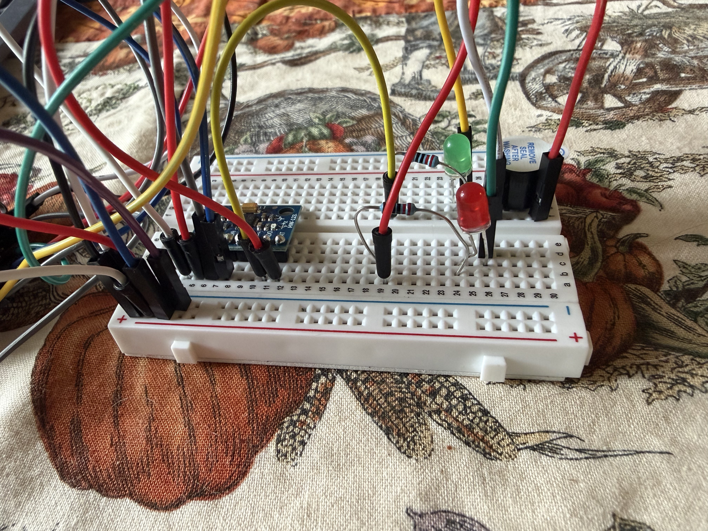
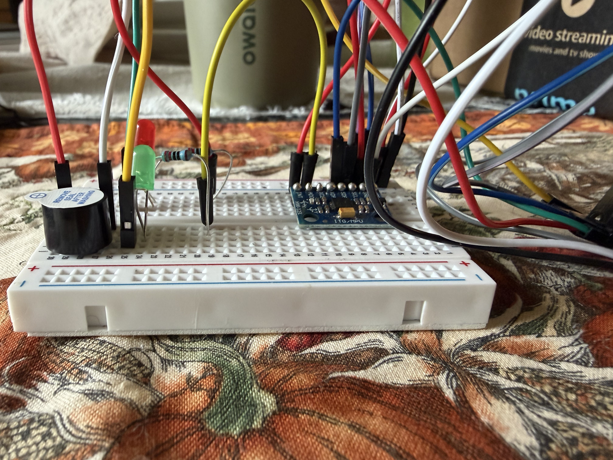
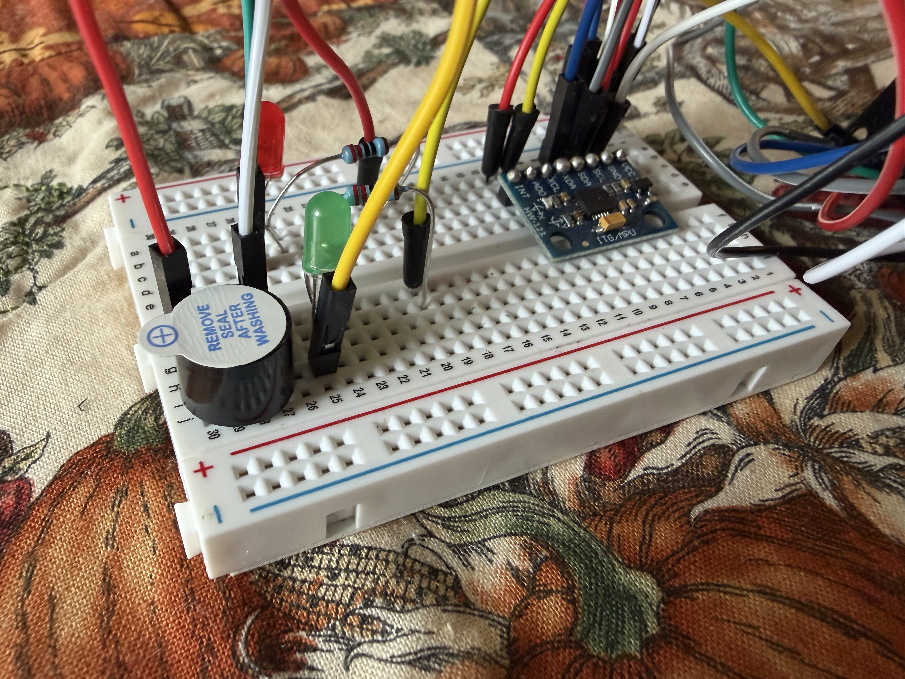

# Pool Safety Monitoring System

An ESP32 breadboard prototype that monitors motion with an MPU6050, signals prolonged stillness with LEDs and a buzzer, and reports DS18B20 probe temperatures over USB serial.

## Current status

The motion sensor, LEDs, buzzer, and temperature probe have been tested together and confirmed working on the bench. This demonstrates sensor and alert operation; it does not establish that the prototype can detect drowning or reliably monitor a swimmer.

## How it works

The motion score is the sum of the absolute changes in X, Y, and Z acceleration since the previous reading:

```text
motion = |X - previousX| + |Y - previousY| + |Z - previousZ|
```

The first reading is ignored for motion scoring. The loop includes a 200 ms delay, so readings occur approximately five times per second.

| Condition | Green LED | Red LED | Buzzer |
|---|---|---|---|
| Motion score greater than 0.5 | On | Off | Off |
| Stillness for less than 15 seconds | On | Off | Off |
| Stillness for 15 seconds or longer | Off | On | On |

Any motion score above **0.5** resets the stillness timer and clears an active alert. These are the current tested settings; older project notes mention a different threshold.

The temperature probe reports Celsius and Fahrenheit approximately once per second. Temperature conversions run without waiting in the motion loop. Temperature is currently displayed only; it does not trigger alerts.

## Hardware

- ESP32 development board
- MPU6050 accelerometer/gyroscope module (blue board)
- DROK DS18B20 metal temperature probe and screw-terminal adapter
- Green and red LEDs with series resistors
- Buzzer supplied with the ELEGOO electronics kit
- Breadboard and jumper wires

The separate 5V buzzer originally tried was quiet. Replacing it with the ELEGOO kit buzzer produced an acceptable volume. No transistor driver was added. The replacement buzzer's exact model and current rating have not been recorded; the wiring below documents the tested setup.

## Current wiring

Unplug USB before changing connections. Read the labels printed on the boards rather than relying on jumper-wire colors.

| Component connection | ESP32 connection / destination |
|---|---|
| Green LED control, through its series resistor | D23 / GPIO 23 |
| Red LED control, through its series resistor | D18 / GPIO 18 |
| Buzzer positive (+) | D19 / GPIO 19 |
| Buzzer negative (-) | Separate ESP32 GND pin |
| MPU6050 VCC | Shared 3.3V rail |
| MPU6050 GND | Shared ground rail |
| MPU6050 SDA and SCL | Existing working I2C connections; exact GPIOs not yet recorded |
| Temperature adapter VCC | Shared 3.3V rail |
| Temperature adapter GND | Shared ground rail |
| Temperature adapter DAT | D4 / GPIO 4 |

The sketch uses the board's default I2C configuration through `mpu.begin()`. It does not explicitly assign SDA and SCL pins. Confirm the physical connections before rebuilding; do not infer them from breadboard row numbers. LED resistor values and exact LED return connections also remain to be recorded.

### Shared power rails

Three wires connect to neighboring holes in the same red **+** rail segment:

1. ESP32 **3V3**
2. MPU6050 **VCC**
3. Temperature adapter **VCC**

Three wires connect to neighboring holes in the same blue **-** rail segment:

1. ESP32 **GND**
2. MPU6050 **GND**
3. Temperature adapter **GND**

The buzzer retains its separate direct GND connection. The red rail is supplied with **3.3V**, not VIN/5V. Rail markings alone do not supply power; the ESP32 wires make these connections.

### Temperature probe to adapter

| Probe wire color | Screw-terminal label |
|---|---|
| Yellow | DAT |
| Red | VCC |
| Black | GND |

The [DROK product listing](https://www.amazon.com/dp/B0FLDQJ71M) identifies these wire colors and states that the adapter includes a pull-up resistor. No additional loose resistor was added to the working setup. Secure bare wire ends in the terminals without allowing loose strands to touch adjacent terminals.

## Breadboard photo reference

These three photos document the working breadboard layout after the temperature sensor was added. Use them alongside the wiring tables above when restoring a disconnected wire. Some wire endpoints, including the temperature adapter and ESP32 pins, are outside the frame or obscured; the photos do not replace the connection list.

The images are saved in the project as full-resolution JPEG copies so they display in the README without depending on the original files in Downloads. Click a photo to open it for a closer look.

### View 1: Power-rail connections and component layout

The shared power-rail wiring is at the left, the blue MPU6050 is near the middle-left, and the LEDs and buzzer are at the right.

[](docs/images/breadboard-1081.jpg)

### View 2: Opposite side

This angle shows the buzzer and LEDs at the left and the MPU6050 header connections at the right.

[](docs/images/breadboard-1082.jpg)

### View 3: Angled view of component placement

This view shows the buzzer, LED legs and resistors, breadboard row markings, and the MPU6050 from above at an angle.

[](docs/images/breadboard-1083.jpg)

## Arduino setup

The main sketch is `Arduino/PoolSafety_MotionDetection/PoolSafety_MotionDetection.ino`.

1. Open that sketch in Arduino IDE.
2. Use the installed ESP32 board support package and the board selection that worked for this hardware.
3. Install these libraries through Library Manager, accepting required dependencies:
   - Adafruit MPU6050
   - Adafruit Unified Sensor
   - Adafruit BusIO
   - OneWire by Paul Stoffregen
   - DallasTemperature by Miles Burton
4. Connect the ESP32 by USB and select its current serial port. The previously used port was `/dev/cu.usbserial-0001`, but it may change.
5. Upload the sketch.
6. Open Serial Monitor at **115200 baud**.

Typical startup output:

```text
MPU6050 Ready!
Temperature readings enabled on D4.
```

During operation, the monitor displays motion scores, `MOVING` or `STILL`, timer/alert messages, and readings such as:

```text
Probe Temperature: 23.50 C / 74.30 F
```

## Confirmed tests

- Moving the MPU6050 turns the green LED on and keeps the buzzer silent.
- Leaving it still for approximately 15 seconds turns on the red LED and buzzer.
- Moving it again clears the alert and restores the green LED.
- The alert sequence was repeated successfully.
- The temperature probe initially read about **71°F**, then rose to about **78°F** when held in a hand.
- The complete system was retested with both sensors and worked as expected.
- The sketch compiled successfully for the generic ESP32 target (`esp32:esp32:esp32`).

The hand-warming test confirms a response to temperature changes, not calibrated measurement accuracy.

## Troubleshooting

| Observation | First check |
|---|---|
| `MPU6050 not found!` | Check the motion sensor's power, ground, SDA, and SCL connections. The sketch stops here if initialization fails. |
| `Temperature sensor not detected. Check DAT, VCC and GND.` | Check adapter DAT to D4, shared 3.3V/ground, and the probe's screw-terminal connections. |
| Red LED turns on but buzzer is silent | With USB unplugged, check the buzzer's negative connection to GND and positive connection to D19. A missing ground caused the original issue. |
| Stillness alert never starts | Watch the motion scores; every reading above 0.5 resets the 15-second timer. |
| Serial Monitor text is unreadable | Set the monitor to 115200 baud. |

## Files

```text
Arduino/
  ESP32_test/
    ESP32_test.ino
  PoolSafety_MotionDetection/
    PoolSafety_MotionDetection.ino
docs/
  images/
    breadboard-1081.jpg
    breadboard-1082.jpg
    breadboard-1083.jpg
README.md
```

## Possible next work

These items are not implemented yet:

- Record a complete wiring diagram, including I2C pins, LED resistor values, and the buzzer model.
- Save sensor readings to a log for later analysis.
- Add a dashboard or network communication.
- Evaluate sensor placement, enclosure design, and behavior beyond bench testing.
