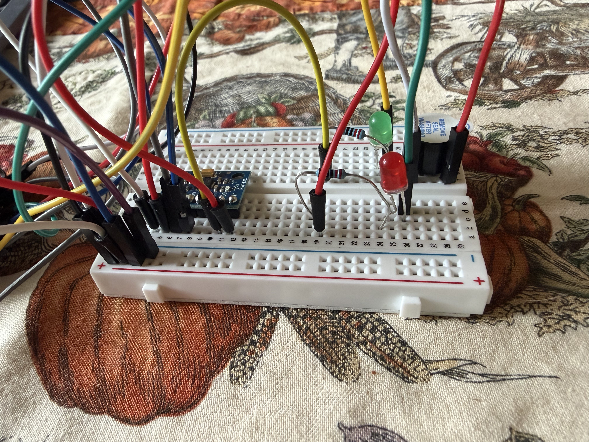
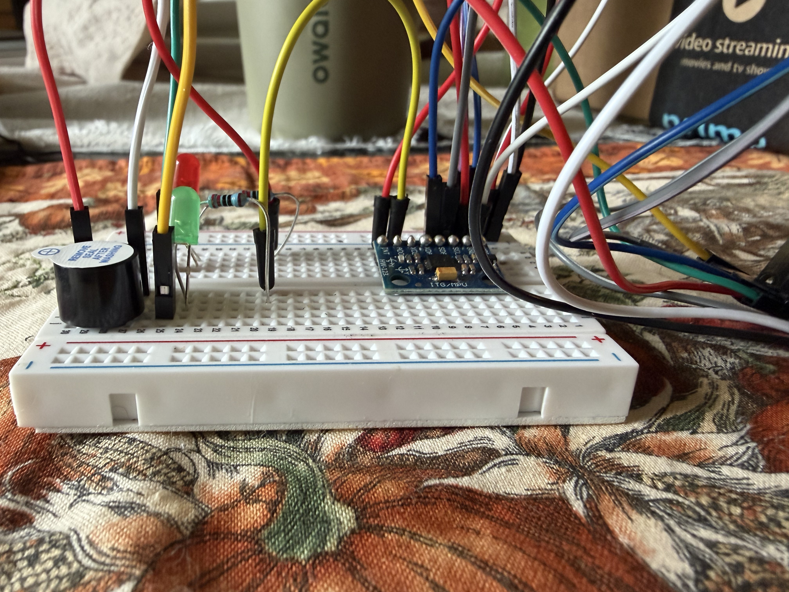
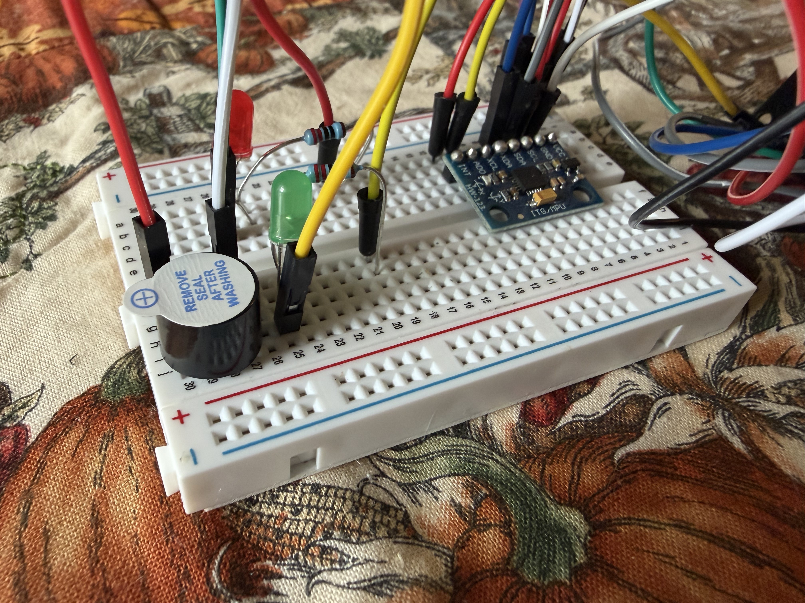

# IoT Pool Activity Monitoring Prototype

An ESP32 prototype that measures movement of a float-mounted MPU6050 and alerts on unexpected water disturbances while armed. It includes local LEDs and a buzzer, a USB/Wi-Fi dashboard, adjustable sensitivity, CSV recording, and a DS18B20 temperature probe.

## Current status

The sensors and previous stillness-alert firmware were tested on the bench. The float assembly has now been tested in a water tank, with distinct recordings for calm water, small ripples, and larger disturbances. The activity-alarm firmware, dashboard controls, and optional Mac-to-phone notifications through ntfy are implemented and software-tested. The activity alarm and phone delivery still need physical verification. Full-size pool testing remains future work. This portfolio prototype detects device movement; it does not establish a swimmer's safety or detect drowning.

## How it works

The motion score is the sum of the absolute changes in X, Y, and Z acceleration since the previous reading:

```text
motion = |X - previousX| + |Y - previousY| + |Z - previousZ|
```

The first reading is ignored for motion scoring. The loop includes a 200 ms delay, so readings occur approximately five times per second.

| Monitoring state | Green LED | Red LED | Buzzer |
|---|---|---|---|
| Disarmed (including power-up/reset) | Off | Off | Off |
| Arming: 10-second settling period | Blinking | Off | Off |
| Armed | On | Off | Off |
| Activity alarm | Off | On | On |
| Motion sensor fault | Off | On | Off, unless an activity alarm was already latched |

After the settling period, **two of the last five readings strictly above the threshold** trigger an alarm. The default threshold is **0.50**; change it from **0.10 to 20.00** while disarmed. Lower values are more sensitive. Five readings span roughly one second at the current sample rate, but networking can add latency. A single isolated spike does not trigger the alarm. The alarm remains latched regardless of subsequent movement or stillness. **Acknowledge alarm** silences it and leaves the device disarmed; explicitly arm again to resume monitoring. Disarming cannot bypass acknowledgment of an active alarm.

The ESP32 owns these rules and controls its outputs independently of the dashboard or Wi-Fi. Disconnecting the dashboard does not disarm it. Power loss/reset starts it disarmed and restores the default threshold; settings are not saved across resets. A sensor fault requires checking the wiring and resetting the device. An already latched alarm remains active if the sensor subsequently fails.

The temperature probe updates approximately once per second without waiting in the motion loop. Its latest Celsius/Fahrenheit values are included in each telemetry message. Temperature is informational and does not trigger alerts.

## First water-tank recordings — October 5, 2026

The assembled prototype places the electronics in a cup supported by a float connected to an arm through hinges. The MPU6050 must be secured so its movement follows the float rather than loose electronics. The cup is not a sealed enclosure. Tests used controlled disturbances limited to avoid wetting the electronics; larger disturbances were greater than the small-ripple test but were not representative pool-entry tests.

| Test | Readings | Recorded duration | Peak motion score | Recorded scores above 0.50 |
|---|---:|---:|---:|---:|
| Calm water | 146 | 30.42 seconds | 0.25 | 0 |
| Small ripples | 255 | 53.30 seconds | 0.91 | 47 |
| Larger disturbances | 347 | 72.59 seconds | 14.40 | 199 |

Sources: preserved recordings [calm.csv](output/water-tests-2026-10-05/calm.csv), [small_ripples.csv](output/water-tests-2026-10-05/small_ripples.csv), and [large_disturbances.csv](output/water-tests-2026-10-05/large_disturbances.csv). New dashboard logs are excluded from Git. Durations use computer receive timestamps. Counts are individual rounded scores, not independently labeled disturbances. A score rounded to 0.50 can have been classified as moving by the old firmware using its unrounded value.

Each trial ended after the old 15-second stillness alarm activated. Both disturbance trials remained below 0.50 over their final 15 seconds. The files' `ALERT` states therefore indicate the **old stillness alarm**, not the new activity alarm. The recordings support 0.50 as an initial sensitive setting; 1.00–1.20 is a candidate for filtering these particular small ripples. They do not establish per-event detection accuracy, long-term false-alarm rates, or performance in a full-size pool.

Offline replay through the new firmware's actual two-of-five controller, assuming it was already armed before each recording, produced no alarm for calm water and an alarm for both disturbance recordings at threshold 0.50. At 1.20, only the larger-disturbance recording triggered. This replay uses saved rounded scores and receive timestamps, skips the startup settling period, and checks the first latched alarm only. It is a software check, not physical verification of the new firmware or a per-disturbance accuracy measurement.

## Hardware

- ESP32 development board
- MPU6050 accelerometer/gyroscope module (blue board)
- DROK DS18B20 metal temperature probe and screw-terminal adapter
- Green and red LEDs with series resistors
- Buzzer supplied with the ELEGOO electronics kit
- Breadboard and jumper wires

The separate 5V buzzer originally tried was quiet. Replacing it with the ELEGOO kit buzzer produced an acceptable volume. No transistor driver was added. The replacement buzzer's exact model and current rating have not been recorded; the wiring below documents the tested setup.

## Current wiring

Unplug USB before changing connections. Read the labels printed on the boards rather than relying on jumper-wire colors.

| Component connection | ESP32 connection / destination |
|---|---|
| Green LED control, through its series resistor | D23 / GPIO 23 |
| Red LED control, through its series resistor | D18 / GPIO 18 |
| Buzzer positive (+) | D19 / GPIO 19 |
| Buzzer negative (-) | Separate ESP32 GND pin |
| MPU6050 VCC | Shared 3.3V rail |
| MPU6050 GND | Shared ground rail |
| MPU6050 SDA and SCL | Existing working I2C connections; exact GPIOs not yet recorded |
| Temperature adapter VCC | Shared 3.3V rail |
| Temperature adapter GND | Shared ground rail |
| Temperature adapter DAT | D4 / GPIO 4 |

The sketch uses the board's default I2C configuration through `mpu.begin()`. It does not explicitly assign SDA and SCL pins. Confirm the physical connections before rebuilding; do not infer them from breadboard row numbers. LED resistor values and exact LED return connections also remain to be recorded.

### Shared power rails

Three wires connect to neighboring holes in the same red **+** rail segment:

1. ESP32 **3V3**
2. MPU6050 **VCC**
3. Temperature adapter **VCC**

Three wires connect to neighboring holes in the same blue **-** rail segment:

1. ESP32 **GND**
2. MPU6050 **GND**
3. Temperature adapter **GND**

The buzzer retains its separate direct GND connection. The red rail is supplied with **3.3V**, not VIN/5V. Rail markings alone do not supply power; the ESP32 wires make these connections.

### Temperature probe to adapter

| Probe wire color | Screw-terminal label |
|---|---|
| Yellow | DAT |
| Red | VCC |
| Black | GND |

The [DROK product listing](https://www.amazon.com/dp/B0FLDQJ71M) identifies these wire colors and states that the adapter includes a pull-up resistor. No additional loose resistor was added to the working setup. Secure bare wire ends in the terminals without allowing loose strands to touch adjacent terminals.

## Breadboard photo reference

These three photos document the working breadboard layout after the temperature sensor was added. Use them alongside the wiring tables above when restoring a disconnected wire. Some wire endpoints, including the temperature adapter and ESP32 pins, are outside the frame or obscured; the photos do not replace the connection list.

The images are saved in the project as full-resolution JPEG copies so they display in the README without depending on the original files in Downloads. Click a photo to open it for a closer look.

### View 1: Power-rail connections and component layout

The shared power-rail wiring is at the left, the blue MPU6050 is near the middle-left, and the LEDs and buzzer are at the right.

[](docs/images/breadboard-1081.jpg)

### View 2: Opposite side

This angle shows the buzzer and LEDs at the left and the MPU6050 header connections at the right.

[](docs/images/breadboard-1082.jpg)

### View 3: Angled view of component placement

This view shows the buzzer, LED legs and resistors, breadboard row markings, and the MPU6050 from above at an angle.

[](docs/images/breadboard-1083.jpg)

## Arduino setup

The main sketch is `Arduino/PoolSafety_MotionDetection/PoolSafety_MotionDetection.ino`.

1. Open that sketch in Arduino IDE.
2. Use the installed ESP32 board support package and the board selection that worked for this hardware.
3. Install these libraries through Library Manager, accepting required dependencies:
   - Adafruit MPU6050
   - Adafruit Unified Sensor
   - Adafruit BusIO
   - OneWire by Paul Stoffregen
   - DallasTemperature by Miles Burton
4. Connect the ESP32 by USB and select its current serial port. The previously used port was `/dev/cu.usbserial-0001`, but it may change.
5. Upload the sketch.
6. Open Serial Monitor at **115200 baud**.

Typical startup output:

```text
MPU6050 Ready!
```

During operation, Serial Monitor displays one JSON telemetry line per cycle, including motion, monitoring state, threshold, temperature, and control acknowledgments. USB and Wi-Fi use the same telemetry fields. For example:

```text
"state":"DISARMED","motion_threshold":0.50
```

## Live dashboard

Wi-Fi is supported: configure the ignored `wifi_secrets.h`, upload the sketch, and start the dashboard with `python3 dashboard/server.py --esp32 YOUR_ESP32_IP`. See [Wi-Fi setup](dashboard/README.md#wi-fi-option). USB remains the default connection. Live Wi-Fi readings and the previous local alarm were verified; dashboard recovery after interrupting the Mac's Wi-Fi was also reported successful. The ESP32's own Wi-Fi reconnection still needs physical testing. Its IP address may change after a router or device restart.

The local dashboard includes arm/disarm and acknowledgment controls, sensitivity adjustment, current readings, graphs, recent state-change events, and CSV recording. Controls require the updated activity-alarm sketch to be uploaded. The server needs no additional Python packages. Older firmware readings remain supported, with controls disabled and clearly labeled as the old firmware.

Close Serial Monitor/Plotter and the standalone logger, then run:

```bash
cd ~/Pool-Safety-Monitoring-System
python3 dashboard/server.py
```

Open <http://127.0.0.1:8765>. Use **Start recording** and **Stop recording** to save a test to `logs/`. Press **Control+C** in Terminal to stop the dashboard.

See [dashboard setup and behavior](dashboard/README.md) for connection troubleshooting and recording details. The dashboard runs on macOS/Linux with Python 3.8+ and does not require internet access.

## Recording readings on your computer

The USB logger runs on macOS or Linux with Python 3.8 or newer and needs no extra Python packages. It reads the current sketch's messages; no firmware upload or wiring change is needed.

1. Connect the ESP32 by USB.
2. Close Arduino Serial Monitor and Serial Plotter so the logger can use the port.
3. In Terminal, run:

```bash
cd ~/Pool-Safety-Monitoring-System
python3 tools/log_sensors.py
```

4. Record a disturbance test or warm the temperature probe in your hand. The standalone logger records only; use the dashboard to arm and control the alarm.
5. Press **Control+C** to stop recording and release the serial port.

Each run creates a timestamped CSV and a raw serial text log in `logs/`. The CSV opens in Excel or another spreadsheet application. Files are flushed during recording, and new runs create new files rather than overwriting previous recordings. Generated logs are excluded from Git.

CSV columns:

| Column | Meaning |
|---|---|
| `time` | Mac/computer local receive time with timezone, not an ESP32 measurement timestamp |
| `motion_score` | Motion score printed by the sketch |
| `state` | `DISARMED`, `ARMING`, `ARMED`, `ALERT`, or `FAULT`; old firmware retains its previous state names |
| `temperature_c`, `temperature_f` | Latest valid probe reading; blank when unavailable (old USB firmware has blanks between updates) |
| `motion_threshold` | Device threshold for this reading; blank for old firmware |

New JSON telemetry rows are saved immediately. Old USB text-format rows complete when the next motion cycle begins; their last unfinished cycle remains only in the raw log. Buffered input is discarded at startup. The raw log retains every received serial line. Old text output remains readable by the logger.

For a timed recording or a different USB port:

```bash
python3 tools/log_sensors.py --seconds 60
python3 tools/log_sensors.py --port /dev/cu.usbserial-0001
```

If no readings arrive, check the USB connection, port selection, and that Serial Monitor/Plotter are closed.

## Historical bench tests (previous firmware)

- Moving the MPU6050 turns the green LED on and keeps the buzzer silent.
- Leaving it still for approximately 15 seconds turns on the red LED and buzzer.
- Moving it again clears the alert and restores the green LED.
- The alert sequence was repeated successfully.
- The temperature probe initially read about **71°F**, then rose to about **78°F** when held in a hand.
- The complete system was retested with both sensors and worked as expected.
- The sketch compiled successfully for the generic ESP32 target (`esp32:esp32:esp32`).

The hand-warming test confirms a response to temperature changes, not calibrated measurement accuracy. The old stillness behavior above was intentionally replaced. Upload and verify the new alarm using the [activity-alarm test procedure](dashboard/README.md#activity-alarm-test).

## Troubleshooting

| Observation | First check |
|---|---|
| Sensor fault / `MPU6050 not found!` | Unplug power, check VCC/GND/SDA/SCL, and reset after repair. The dashboard stays available but cannot arm with a sensor fault. |
| Temperature unavailable | Check adapter DAT to D4, shared 3.3V/ground, and the probe's screw-terminal connections. |
| Red LED turns on but buzzer is silent | With USB unplugged, check the buzzer's negative connection to GND and positive connection to D19. A missing ground caused the original issue. |
| Activity alarm does not trigger | Confirm the device is armed after settling; two of the last five readings must exceed its selected threshold. |
| Controls disabled | Upload the new sketch and verify a live connection. Sensitivity changes require disarming; active alarms require acknowledgment. |
| Serial Monitor text is unreadable | Set the monitor to 115200 baud. |

## Files

```text
Arduino/
  ESP32_test/
    ESP32_test.ino
  PoolSafety_MotionDetection/
    PoolSafety_MotionDetection.ino
docs/
  images/
    breadboard-1081.jpg
    breadboard-1082.jpg
    breadboard-1083.jpg
README.md
```

## Possible next work

These items are not implemented yet:

- Record a complete wiring diagram, including I2C pins, LED resistor values, and the buzzer model.
- Analyze recorded sensor logs and compare different bench tests.
- Verify [iPhone notifications](dashboard/README.md#phone-notifications-iphone) during controlled tank trials and capture a complete demo.
- Add authenticated remote dashboard access or an always-on gateway to replace the Mac bridge.
- Build a splash-protected enclosure and secure permanent connections.
- Measure repeatable event detection and false alarms, then evaluate behavior in a full-size pool.
